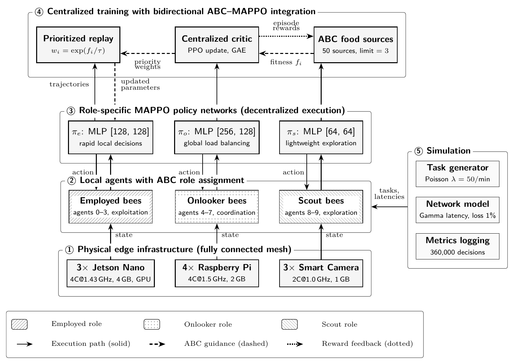

# D-MAPPO-ABC

**Distributed Multi-Agent Proximal Policy Optimization Enhanced with Artificial Bee Colony for Edge Computing Task Scheduling**

[](https://www.python.org/downloads/)
[](https://pytorch.org/)
[](LICENSE)

## Overview

D-MAPPO-ABC is a hybrid framework that integrates **Multi-Agent Proximal Policy Optimization (MAPPO)** with the **Artificial Bee Colony (ABC)** algorithm for distributed edge computing task scheduling.

The framework maps ABC's three bee roles (employed, onlooker, scout) to **distinct MAPPO policy networks** with heterogeneous architectures, enabling distributed decision-making while preserving swarm intelligence benefits. A bidirectional integration mechanism allows ABC fitness values to guide MAPPO experience replay prioritization, while RL rewards update ABC food source evaluations.

### Key Results

All values are mean ± std over **10 independent random seeds × 10 episodes** (Welch *t*-tests vs. every baseline: *p* < 0.001).

| Metric | D-MAPPO-ABC | Best MARL Baseline | Improvement |
|--------|:-----------:|:-------------------:|:-----------:|
| **Reward** | 38.4 ± 4.4 | 30.1 ± 0.8 (CommNet-inspired) | **+27.8%** |
| **Mean Task Latency** | 21.1 ± 4.1 ms | 504.0 ± 17.8 ms | **−96%** |
| **Decision (Inference) Latency** | ≈0.02 ms (GPU) | <0.001–0.03 ms (rule-based) | negligible for all |
| **Deadline Miss Rate** | 0.00% | 0.06% | **−100%** |
| **Energy (SEU)** | 33,019 ± 3 | 33,459 ± 15 | **−1.3%** |
| **Scalability** | 50 agents | 25 agents | **+100%** |

Additional evaluations: **fault tolerance** (continued operation under 30% mid-episode agent loss; task latency 20 → 93 ms, completion ratio 99.99%), **network sensitivity** (−6.2% reward at 10% packet loss; congestion is the dominant stressor), and **communication scaling** (measured *O(N)*: 5/10/20/50 msgs/step for N = 5/10/20/50 vs. *O(N²)* centralized).

## Architecture

<p align="center">
  
</p>

D-MAPPO-ABC follows the CTDE (Centralized Training, Decentralized Execution) paradigm across five layers: (1) heterogeneous edge devices, (2) local agents with ABC role assignment (employed/onlooker/scout), (3) role-specific MAPPO policy networks executed independently at deployment, (4) centralized training with bidirectional ABC↔MAPPO integration (episode rewards update food-source fitness; ABC fitness guides experience-replay priority), and (5) the simulation environment. This is Figure 2 from the paper.

## Repository Structure

```
d_mappo_abc/
├── agents/
│   ├── base_agent.py          # Base agent with state/action spaces
│   └── abc_agent.py           # ABC-enhanced agent (food source tracking,
│                              #   scout activation, fitness evaluation)
├── configs/
│   ├── abc_config.yaml        # ABC parameters (food sources, abandonment limit)
│   ├── env_config.yaml        # Environment (devices, tasks, network)
│   └── training_config.yaml   # Training hyperparameters (lr, gamma, clip)
├── envs/
│   ├── edge_scheduling_env.py # 10-device edge computing simulator
│   └── task_generator.py      # Poisson task arrival (λ=50/min, 4 types)
├── policies/
│   ├── employed_policy.py     # πe: [128,128] rapid local decisions
│   ├── onlooker_policy.py     # πo: [256,128] global coordination
│   └── scout_policy.py        # πs: [64,64] exploration
├── utils/
│   ├── logger.py              # Training/deployment logging
│   ├── metrics.py             # Reward, latency, energy, deadline metrics
│   └── visualizer.py          # Training curves & deployment plots
├── experiments/
│   ├── train_d_mappo_abc.py           # RLlib training entry point
│   ├── evaluate_advanced_baselines.py # MARL-inspired baselines (IPPO, QMIX, CommNet, MADDPG, WRR)
│   └── rev2/                          # Multi-seed evaluation suite (paper revision 2)
│       ├── harness.py                 # Env builders + all controllers + episode runner
│       ├── policy_runner.py           # Lightweight checkpoint loader (no Ray needed)
│       ├── hybrid_baselines.py        # Zhao MARL-ABC / FADDEER / Wang re-implementations
│       ├── run_multiseed.py           # 10-seed statistical comparison (Table 12)
│       ├── run_fault_tolerance.py     # 10–30% agent-failure experiments (Table 17)
│       ├── run_network_sensitivity.py # Packet loss / congestion sweeps (Table 18)
│       ├── run_load_scenarios.py      # Load scenarios (Table 16)
│       ├── run_scalability_overhead.py# Message counts & memory, N = 5–50 (Table 14)
│       ├── run_hybrid_baselines.py    # Hybrid baseline evaluation
│       ├── tune_baselines.py          # Grid searches documented in Appendix B
│       ├── analyze_multiseed.py       # Welch t-tests, Cohen's d, figures
│       └── results/                   # Raw per-episode CSVs from the paper
├── logs/checkpoints/policies/         # Trained policy weights (πe, πo, πs)
├── requirements.txt
└── setup.py
```

## Reproducing the Paper's Experiments

The trained checkpoints are included, so all evaluation experiments run without retraining:

```bash
# Statistical baseline comparison, 10 seeds × 10 episodes per method (~60 min)
python experiments/rev2/run_multiseed.py

# Fault tolerance: 10/20/30% agent loss at episode midpoint (~5 min)
python experiments/rev2/run_fault_tolerance.py

# Network sensitivity: packet loss 1–10%, congestion 2–4× (~10 min)
python experiments/rev2/run_network_sensitivity.py

# Load scenarios, hybrid baselines, scalability
python experiments/rev2/run_load_scenarios.py
python experiments/rev2/run_hybrid_baselines.py
python experiments/rev2/run_scalability_overhead.py

# Statistics (Welch t-tests, Cohen's d) + paper figures
python experiments/rev2/analyze_multiseed.py
```

Raw per-episode results used in the paper are provided under `experiments/rev2/results/`.

## Quick Start

### Installation

```bash
# Clone the repository
git clone https://github.com/muhammedsara/d_mappo_abc.git
cd d_mappo_abc

# Install dependencies
pip install -r requirements.txt
```

### Training

```bash
# Train D-MAPPO-ABC (500 episodes, ~6 hours on RTX 2070)
python -m agents.abc_agent --config configs/training_config.yaml

# Training with custom parameters
python -m agents.abc_agent \
    --num-episodes 500 \
    --num-agents 10 \
    --abandonment-limit 3 \
    --lr 1e-4
```

### Deployment

```bash
# Run deployment evaluation (100 episodes)
python -m utils.metrics --checkpoint checkpoints/best_model.pt --episodes 100

# Start FastAPI policy server for production
uvicorn serve:app --host 0.0.0.0 --port 8000
```

## Configuration

### Key Parameters

| Parameter | Value | Description |
|-----------|:-----:|-------------|
| `num_agents` | 10 | Number of edge devices |
| `num_food_sources` | 50 | ABC food source count |
| `abandonment_limit` | 3 | Scout activation threshold (episodes without improvement) |
| `scout_exploration_rate` | 0.3 | ε-greedy rate during scout exploration |
| `learning_rate` | 1×10⁻⁴ | Adam optimizer learning rate |
| `gamma` | 0.99 | Discount factor |
| `lambda_gae` | 0.95 | GAE parameter |
| `clip_param` | 0.2 | PPO clipping parameter |
| `entropy_coeff` | 0.01→0.001 | Linear decay over 500 episodes |
| `batch_size` | 4096 | Transitions per update |
| `mini_batch_size` | 256 | SGD mini-batch size |

### Reward Function Weights

| Component | Weight | Description |
|-----------|:------:|-------------|
| Latency | 0.3 | Task completion speed |
| Throughput | 0.3 | Successful task rate |
| Energy | 0.2 | Power consumption |
| Load Balance | 0.1 | Jain fairness index |
| Deadline Penalty | 0.1 (×100) | Strict deadline enforcement |

## Environment

The edge computing simulator models:

- **10 heterogeneous devices**: Jetson Nano (×3, 4-core 1.43GHz, 4GB, 128-core GPU), Raspberry Pi 4 (×4, 4-core 1.5GHz, 2GB), Smart Camera (×3, 2-core 1.0GHz, 1GB)
- **4 task types**: Face recognition (500ms deadline), Object detection (1000ms), Anomaly detection (2000ms), Preprocessing (5000ms)
- **Poisson task arrival**: λ = 50 tasks/min
- **Mesh network topology**: 45 bidirectional links, Gamma-distributed latency (mean 30ms)
- **Cloud fallback**: 150ms mean latency, 0.5 reward penalty

**State space**: 15-dimensional (CPU, memory, temperature, queue, load, energy, network latency, bandwidth, packet loss, task features, neighbor states)

**Action space**: 12 discrete actions (local execution, 9 neighbor offloads, cloud offload, reject)

## Ablation Study

| Variant | Reward | Deadline Miss | Δ Reward |
|---------|:------:|:-------------:|:--------:|
| **Full D-MAPPO-ABC** | **38.82** | **0.00%** | — |
| w/o ABC (Pure MAPPO) | −250.00 | 2.00% | −288.82 |
| w/o Scout | 32.15 | 0.00% | −6.67 |
| w/o Onlooker | 28.45 | 0.01% | −10.37 |
| Single Policy | 15.32 | 0.80% | −23.50 |

**Contribution hierarchy**: ABC integration (Δ=+288.82) > Role specialization (Δ=+23.50) > Onlooker coordination (Δ=+10.37) > Scout exploration (Δ=+6.67)

## Requirements

- Python 3.8+
- PyTorch 2.0+
- Ray RLlib 2.5+
- NumPy ≥ 1.21
- Gymnasium ≥ 0.28
- PettingZoo ≥ 1.24
- PyYAML ≥ 6.0
- Matplotlib ≥ 3.5
- **GPU**: NVIDIA RTX 2070 or equivalent (CUDA support)

## Citation

If you use this code in your research, please cite:

```bibtex
@article{sara2026dmappoabc,
  title={D-MAPPO-ABC: Distributed Multi-Agent Proximal Policy Optimization 
         Enhanced with Artificial Bee Colony for Edge Computing Task Scheduling},
  author={{\c{S}}ara, Muhammed and {\"O}zdemir, Koray and Eken, S{\"u}leyman 
          and Tuncer, Adem},
  journal={Annals of Operations Research (under review)},
  year={2026}
}
```

## License

This project is licensed under the MIT License — see the [LICENSE](LICENSE) file for details.

## Contact

For questions regarding this implementation, please contact the corresponding author.
